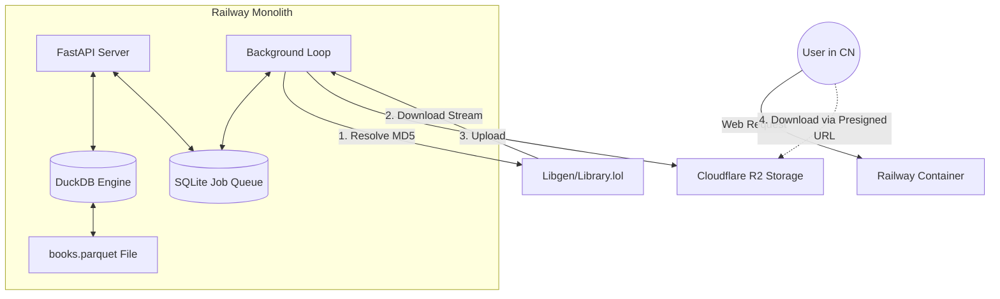

这是一个结构化、模块化的架构设计文档，你可以直接拷贝到新的对话窗口中，作为上下文（Context）发给 AI。

---

# 项目架构文档：EasyBook - 异步按需图书检索系统

## 1. 项目背景与约束 (Context & Constraints)

### 1.1 核心目标

构建一个面向小规模私域用户（约 100 人，日均 <100 次请求）的电子书检索与下载服务。系统不存储全量电子书文件，而是基于元数据搜索，并在用户发起请求后，异步从互联网（Shadow Libraries）获取资源并中转交付。

### 1.2 关键约束

* **网络环境**：最终用户位于中国大陆（网络受限），无法直接访问 Libgen/IPFS。服务器部署在海外（Railway），可访问外部资源。
* **成本控制**：极低成本（Hobby/Starter Plan）。无法通过扩容 RAM/CPU 来支撑重型索引（如 Meilisearch）或全量存储。
* **数据源现状**：
* 拥有 Anna's Archive 的元数据（CSV/SQL），但部分缺乏 IPFS CID。
* 核心关联键为 **MD5**。
* 必须通过 MD5 实时解析真实下载链接。


---

## 2. 核心架构理念 (Core Philosophy)

从 **“全量索引 + 直接下载”** 转型为 **“DuckDB 轻量索引 + 异步代购模式”**。

* **Store Metadata, Fetch Content**：本地只存元数据（几 GB），文件按需获取。
* **Async by Default**：用户请求 -> 任务队列 -> 后台下载 -> 中转存储 -> 通知用户。
* **Bridge the Wall**：服务器作为中转代理，解决用户无法连接数据源的问题。

---

## 3. 技术栈选型 (Tech Stack)

| 模块 | 选型 | 理由 |
| --- | --- | --- |
| **后端框架** | **FastAPI (Python)** | 高性能，易于编写异步爬虫和文件流处理。 |
| **搜索/索引** | **DuckDB + Parquet** | **核心决策**。替代 Meilisearch。将 2000万+ 元数据压缩为 Parquet 文件（约 3-5GB），利用 DuckDB 进行 SQL 查询。无服务进程，零内存常驻。 |
| **任务队列** | **SQLite** | **核心决策**。替代 Redis。由于并发极低（<100/天），使用 SQLite 的 `jobs` 表管理任务状态（pending, processing, done）绰绰有余。 |
| **资源解析** | **Python (Requests/BS4)** | 针对 `library.lol` 或 Libgen 镜像站的特定爬虫，通过 MD5 解析直链。 |
| **中转存储** | **Cloudflare R2** | **核心决策**。替代本地存储。兼容 S3 API，**出口流量免费**，适合文件分发。 |
| **部署环境** | **Railway** | 容器化部署，挂载 Volume 存储 Parquet 索引文件。 |

---

## 4. 数据流与工作流 (Data Flow)

### 4.1 阶段一：元数据搜索 (Synchronous)

1. 用户在前端输入书名（如 "Python Programming"）。
2. FastAPI 接收请求，调用 DuckDB。
3. DuckDB 读取挂载的 `.parquet` 文件，执行 SQL (`SELECT * FROM books WHERE title ILIKE ...`)。
4. **返回**：书籍列表（包含 Title, Author, Year, **MD5**），但不包含下载链接。

### 4.2 阶段二：异步获取任务 (Asynchronous)

1. 用户点击“获取资源”。
2. 后端在 SQLite `jobs` 表中创建一条记录：`{id: uuid, md5: xxx, status: 'pending', user_id: 123}`。
3. 立即返回前端：“正在为您寻找资源，请稍候”。

### 4.3 阶段三：后台履约 (The Worker)

后台启动一个 Python 调度器（APScheduler 或 简单 Loop），每 10 秒轮询 `pending` 任务：

1. **解析 (Resolve)**：
* Worker 拿到 MD5。
* 请求网关页：`http://library.lol/main/{MD5}`。
* **策略**：解析 HTML，提取指向 `Cloudflare` 或 `GET` 的真实 `href` 链接。
* *备选*：如果页面包含 IPFS CID，尝试通过 IPFS Gateway 获取。


2. **下载 (Download)**：
* 流式下载文件到 Railway 的 `/tmp` 目录。


3. **中转 (Upload)**：
* 将文件上传至 **Cloudflare R2**，设置 Content-Disposition 和 Content-Type。
* 配置 R2 对象的生命周期（Lifecycle Rule），例如 7 天后自动删除（节省存储空间）。


4. **交付 (Delivery)**：
* 生成 R2 的预签名链接（Presigned URL，有效期 24 小时）。
* 更新 SQLite 记录：`status='done'`, `download_url='https://r2.my-domain.com/...'`。


---

## 5. 关键代码逻辑规范

### 5.1 DuckDB 查询封装

```python
import duckdb

def search_books(query: str, limit: int = 20):
    # 每次查询瞬时连接，无需常驻服务
    con = duckdb.connect() 
    # 直接查询 Parquet 文件，无需加载进内存
    sql = f"""
        SELECT title, author, year, md5 
        FROM 'data/books.parquet' 
        WHERE title ILIKE '%{query}%' 
        ORDER BY year DESC 
        LIMIT {limit}
    """
    return con.execute(sql).fetchall()

```

### 5.2 Libgen 解析器逻辑

解析器必须具备**两步跳转**能力，严禁直接拼接 URL。

* **Input**: MD5 String
* **Step 1**: GET `http://library.lol/main/{MD5}`
* **Step 2**: Parse HTML via BeautifulSoup -> Find tag `<a href="...">GET</a>` or `Cloudflare`
* **Step 3**: Return strict URL.
* **Error Handling**: 若 `library.lol` 403/500，需具备重试机制或切换到 `libgen.li`。

---

## 6. 部署架构图 (Deployment)



## 7. 下一步实施计划

1. **数据清洗**：编写脚本将 CSV 转换为 Parquet，并验证 DuckDB 检索速度。
2. **核心爬虫验证**：编写 `resolve_md5.py` 脚本，测试在 Railway 环境下访问 `library.lol` 的连通性。
3. **原型开发**：集成 FastAPI + DuckDB + SQLite 最小闭环。